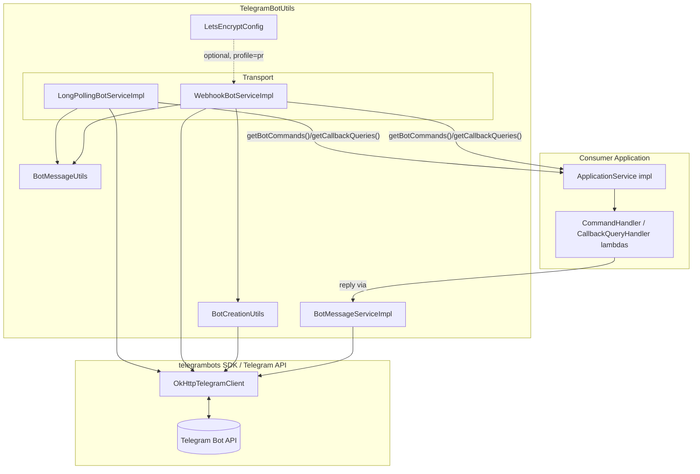
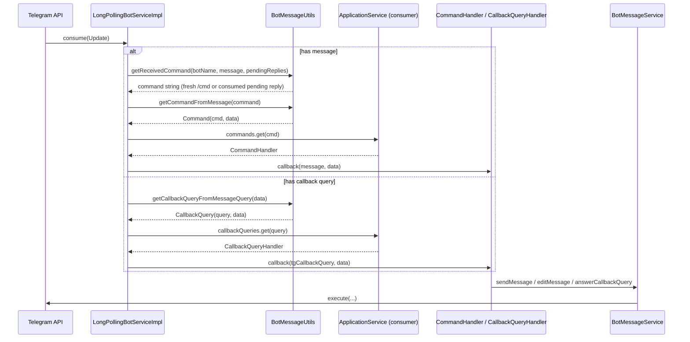

# Codebase Map

> Auto-generated by Cartographer. Last mapped: 2026-08-25T17:23:24Z

## System Overview

TelegramBotUtils is a small **Spring Boot library** (not a standalone app) that provides
reusable scaffolding for building Telegram bots on top of the official
`telegram-telegrambots` Java SDK's Spring Boot starters — supporting both **long-polling**
and **webhook** transport modes, plus optional Let's Encrypt HTTP-01 challenge handling for
self-managed webhook SSL. Consumers implement one interface (`ApplicationService`) to
register command/callback-query handlers; the library parses incoming updates, dispatches
to the right handler, and offers a wrapped outbound-messaging API (`BotMessageService`).



## Directory Structure

```
TelegramBotUtils/
├── pom.xml                          # Maven module, versions inherited from parent POM
├── README.md                        # Spanish usage guide (partially stale, see Gotchas)
└── src/main/
    ├── java/org/themarioga/game/
    │   ├── config/
    │   │   └── LetsEncryptConfig.java        # optional ACME challenge endpoint wiring
    │   ├── constants/
    │   │   ├── BotConstants.java             # chat-type literals
    │   │   └── BotResponseErrorI18n.java     # hardcoded Spanish error strings
    │   ├── model/
    │   │   ├── Command.java                  # parsed /command DTO
    │   │   ├── CallbackQuery.java            # parsed callback_data DTO (name clash, see Gotchas)
    │   │   ├── CommandHandler.java           # consumer-supplied functional interface
    │   │   └── CallbackQueryHandler.java     # consumer-supplied functional interface
    │   ├── service/
    │   │   ├── intf/
    │   │   │   ├── ApplicationService.java   # consumer's extension point
    │   │   │   ├── BotMessageService.java    # outbound messaging contract
    │   │   │   └── BotService.java           # abstraction over a running bot
    │   │   └── impl/
    │   │       ├── BotMessageServiceImpl.java       # wraps TelegramClient for sends/edits
    │   │       ├── LongPollingBotServiceImpl.java   # long-polling BotService
    │   │       └── WebhookBotServiceImpl.java       # webhook BotService
    │   └── util/
    │       ├── BotCreationUtils.java         # webhook (de)registration, cert loading
    │       └── BotMessageUtils.java          # update parsing/formatting helpers
    └── resources/
        ├── default-formatter-config.xml      # inherited code-formatter config
        └── supressed-cve-exceptions.xml       # OWASP dependency-check suppressions
```

## Module Guide

### model — vocabulary & consumer contracts

**Purpose**: Data-carrying DTOs and the functional-interface contracts a consumer implements to receive dispatched commands/callbacks.

| File | Purpose | Tokens |
|------|---------|--------|
| `Command.java` | Mutable POJO: parsed `command` + `commandData` | 128 |
| `CallbackQuery.java` | Mutable POJO: parsed `query` + `queryData` | 130 |
| `CommandHandler.java` | `void callback(Message message, String params)` | 35 |
| `CallbackQueryHandler.java` | `void callback(CallbackQuery callbackQuery, String params)` (Telegram SDK type) | 39 |

**Gotcha**: `org.themarioga.game.model.CallbackQuery` shares its simple name with
`org.telegram.telegrambots.meta.api.objects.CallbackQuery`, the type actually used in
`CallbackQueryHandler.callback(...)`. Easy to import the wrong one.

### service/intf — public contracts

**Purpose**: Interfaces defining the library's public API surface.

| File | Purpose | Tokens |
|------|---------|--------|
| `ApplicationService.java` | Consumer implements: returns `Map<String,CommandHandler>` and `Map<String,CallbackQueryHandler>` | 68 |
| `BotMessageService.java` | send/edit/delete message, answer callback query, sanitize text; nested `Callback` interface for async sends | 184 |
| `BotService.java` | Abstraction over a running bot: token, name, handler maps, pending replies, `TelegramClient`, `getBean()` | 140 |

**Dependents**: `service/impl` classes implement these; `ApplicationService` is implemented by library consumers.

### service/impl — concrete bot services

**Purpose**: The two transport implementations plus the outbound-message wrapper. Contains the update-dispatch logic (largely duplicated between the two transports).

| File | Purpose | Tokens |
|------|---------|--------|
| `LongPollingBotServiceImpl.java` | `BotService` + `SpringLongPollingBot` + `LongPollingSingleThreadUpdateConsumer`; `consume(Update)` is the dispatch entry point | 1045 |
| `WebhookBotServiceImpl.java` | `BotService`; builds `SpringTelegramWebhookBot` via builder; `onWebhookUpdateReceived(Update)` is the dispatch entry point, always returns `null` | 1140 |
| `BotMessageServiceImpl.java` | Implements `BotMessageService`; wraps `botService.getTelegramClient().execute(...)`, swallows `TelegramApiException` (logs only) | 878 |

**Dependencies**: `util.BotMessageUtils` (parsing), `util.BotCreationUtils` (webhook impl only), `constants.*`.
**Dependents**: Consumer wires these as Spring `@Bean`s; `ApplicationService` implementations receive a `BotMessageService`.

### util — stateless helpers

**Purpose**: Static helper functions shared by `service/impl`.

| File | Purpose | Tokens |
|------|---------|--------|
| `BotCreationUtils.java` | `setWebhook`, `deleteWebhook`, `getCertificate` — used by `WebhookBotServiceImpl` | 355 |
| `BotMessageUtils.java` | `isMessagePrivate`, `getReceivedCommand` (core routing logic incl. pending-reply consumption), `getCommandFromMessage`, `getCallbackQueryFromMessageQuery`, `getUserInfo`, `getUsername`, `arrayToMessage` | 648 |

**Gotcha**: `BotCreationUtils` does **not** contain the `createLongPollingBot`/`createWebhookBot`
factory methods the README documents — see Gotchas below.

### constants

| File | Purpose | Tokens |
|------|---------|--------|
| `BotConstants.java` | `TELEGRAM_MESSAGE_TYPE_PRIVATE = "private"` | 45 |
| `BotResponseErrorI18n.java` | Hardcoded Spanish user-facing error strings (`COMMAND_DOES_NOT_EXISTS`, `COMMAND_SHOULD_BE_ON_PRIVATE`, `COMMAND_SHOULD_BE_ON_GROUP`, `UNKNOWN_ERROR` — unused) | 129 |

### config

| File | Purpose | Tokens |
|------|---------|--------|
| `LetsEncryptConfig.java` | Empty `@Configuration` shim; `@Import`s the Let's Encrypt Tomcat ACME challenge endpoint, active only under Spring profile `pro` + `lets-encrypt-helper.enabled=true` | 118 |

Orthogonal to the dispatch flow — only relevant to webhook bots that self-terminate SSL via Let's Encrypt.

## Data Flow

### Update dispatch (long polling)



Webhook mode (`WebhookBotServiceImpl.onWebhookUpdateReceived`) follows the **same dispatch
logic**, just triggered by an HTTP POST to `/{botName}` instead of an SDK-pushed `Update`;
it always returns `null` since replies go out via `telegramClient.execute(...)` rather than
as the HTTP response body.

### Pending-reply flow

A handler can call `botService.setPendingReply(userId, command)` to mark that the user's
*next reply message* should be treated as invoking `command`. `BotMessageUtils.getReceivedCommand`
checks `message.isReply()` plus the `pendingReplies` map and **consumes** (removes) the entry
when matched. **Only one pending reply per user id is allowed at a time** — setting a second
one before the first is consumed throws `UnsupportedOperationException`.

## Conventions

- **Interface + impl split**: every `service/intf` interface has exactly one (or, for
  `BotService`, two) `service/impl` implementation(s).
- **Non-instantiable utility/constants classes**: private constructors throw
  (`IllegalStateException`/`UnsupportedOperationException`) — used consistently across
  `constants` and `util`.
- **`__` payload delimiter**: command and callback_data strings embed extra payload after a
  double-underscore, e.g. `/menu__page2` or `example_query__somepayload`, split by
  `BotMessageUtils.getCommandFromMessage` / `getCallbackQueryFromMessageQuery`.
- **`@botname` mention stripping**: incoming `/command@BotName` text has the mention stripped
  before matching against registered commands (group-chat support).
- **HTML parse mode hardcoded**: `BotMessageServiceImpl` always sends with
  `sendMessage.enableHtml(true)` / `EditMessageText` `.parseMode("HTML")` — no plain-text option.
- **Versionless dependencies**: `pom.xml` declares zero explicit versions; everything is
  inherited from parent POM `org.themarioga:parent:2.0.0`.

## Gotchas

- **README is stale**: it documents `BotCreationUtils.createLongPollingBot(...)` /
  `createWebhookBot(...)` factory methods that do **not exist** in current source. Consumers
  following the README literally get compile errors; the actual pattern is to `new` up
  `LongPollingBotServiceImpl(token, name, applicationService)` or
  `WebhookBotServiceImpl(token, name, webhookURL, webhookCertPath, applicationService)` directly.
- **`CallbackQuery` name collision**: local `model.CallbackQuery` DTO vs. Telegram SDK's
  `org.telegram.telegrambots.meta.api.objects.CallbackQuery` — the handler interface uses the
  SDK type, not the local DTO. Easy to import the wrong class.
- **Swallowed exceptions**: `BotMessageServiceImpl` catches all `TelegramApiException`s and
  only logs them (`logger.error`) — send/edit/delete failures are invisible to callers.
- **Inconsistent log levels**: `BotCreationUtils.setWebhook` failures log at `info`, while the
  rest of the codebase logs errors at `error` — could mask real webhook registration failures.
- **Duplicated dispatch logic**: `LongPollingBotServiceImpl.consume` and
  `WebhookBotServiceImpl.onWebhookUpdateReceived` implement nearly identical update-dispatch
  logic with no shared extraction — a refactor candidate.
- **`setPendingReply` throws on double-set**: calling it twice for the same user before the
  first is consumed throws `UnsupportedOperationException` rather than overwriting.
- **In-memory, non-persistent state**: `pendingReplies` is a plain `HashMap`, lost on restart,
  not shared across instances.
- **No input validation on callback_data**: `getCallbackQueryFromMessageQuery` trusts the
  `"__"`-delimited format with no defense against malformed/forged callback_data from clients.
- **`spring.main.allow-circular-references=true` required** (per README): implies a circular
  dependency between the bot bean and `ApplicationService`/`BotMessageService` wiring, worked
  around via setter injection for `BotMessageService` in consumer's `ApplicationService` impl.
- **No test sources**: no `src/test` directory exists in this repo.

## Navigation Guide

**To add a new bot command**: Implement it in the consumer's `ApplicationService.getBotCommands()`
map — no library changes needed. To change how commands are parsed/routed, edit
`util/BotMessageUtils.java` (`getReceivedCommand`, `getCommandFromMessage`).

**To add a new callback-query handler**: Same pattern via `ApplicationService.getCallbackQueries()`;
parsing logic lives in `BotMessageUtils.getCallbackQueryFromMessageQuery`.

**To change outbound message behavior** (e.g. parse mode, add a new send variant): edit
`service/intf/BotMessageService.java` (contract) and `service/impl/BotMessageServiceImpl.java`
(implementation).

**To modify webhook registration/certificate handling**: `util/BotCreationUtils.java`
(`setWebhook`, `deleteWebhook`, `getCertificate`), invoked from `WebhookBotServiceImpl`'s builder.

**To modify the long-polling vs. webhook dispatch logic**: `service/impl/LongPollingBotServiceImpl.java`
`consume(...)` and `service/impl/WebhookBotServiceImpl.java` `onWebhookUpdateReceived(...)` — note
these are duplicated, so changes usually need to be made in both places.

**To add/change Let's Encrypt SSL behavior**: `config/LetsEncryptConfig.java`, gated by Spring
profile `pro` and property `lets-encrypt-helper.enabled`.

**To fix the stale README**: update it to reflect direct constructor usage of
`LongPollingBotServiceImpl`/`WebhookBotServiceImpl`, or reintroduce the `createLongPollingBot`/
`createWebhookBot` factory methods in `BotCreationUtils` if that's the intended API.
