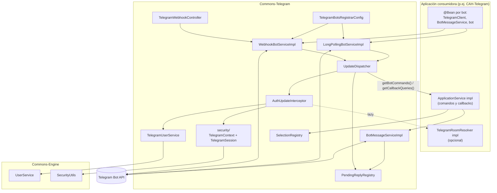
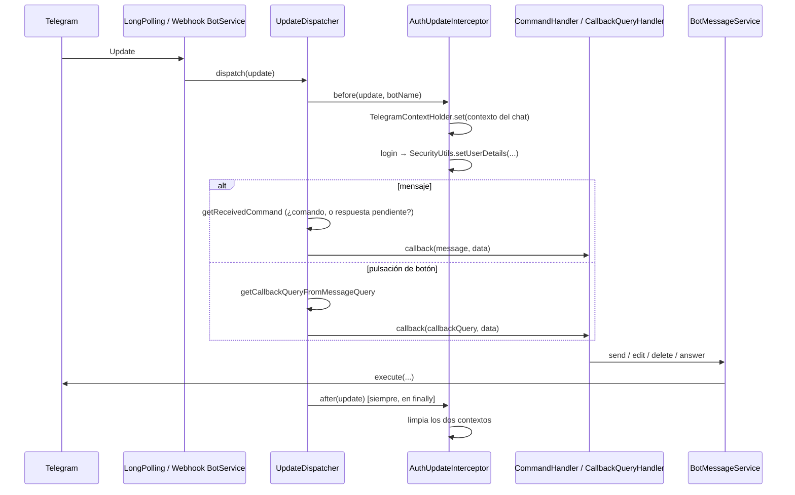

# Codebase Map

Mapa de `Commons-Telegram`: qué hay, por qué está así y dónde están las trampas.

## System Overview

Es la librería que comparten los bots de Telegram del proyecto. Resuelve tres cosas que todos
necesitan y ninguno debería reimplementar: **quién habla** (identidad y sesión), **a quién le toca
atender esto** (reparto de updates) y **cómo se contesta** (envíos).

Lo que la hace distinta de un envoltorio del SDK es que conecta la identidad de Telegram con la del
motor: el `TelegramUser` que llega en un update acaba en el contexto de Spring Security como un
`User` de `commons-engine`, que es de donde lo leen los servicios del juego.



## Directory Structure

```
src/main/java/org/themarioga/commons/telegram/
├── config/
│   ├── TelegramBotsRegistrarConfig.java  # arranca los bots (sustituye a los dos starters)
│   ├── TelegramWebhookController.java    # el endpoint HTTP que el starter no trae
│   ├── TelegramAdmins.java               # telegram.bots.admin-ids
│   └── LetsEncryptConfig.java            # reto ACME, solo perfil pro
├── constants/
│   ├── BotConstants.java                 # tipos de chat
│   └── BotResponseErrorI18n.java         # errores del propio despachador (comando desconocido)
├── models/
│   ├── TelegramUser.java                 # id de Telegram ↔ User del motor
│   ├── Command.java / CallbackQuery.java # DTOs del texto ya troceado
│   ├── CommandHandler.java / CallbackQueryHandler.java  # lo que implementa el consumidor
│   └── UpdateInterceptor.java            # before/after alrededor de cada update
├── dao/{intf,impl}/                      # TelegramUserDao
├── services/
│   ├── intf/
│   │   ├── ApplicationService.java       # punto de extensión del consumidor
│   │   ├── BotMessageService.java        # envíos
│   │   ├── BotService.java               # un bot en marcha
│   │   ├── TelegramUserService.java      # register / login
│   │   └── TelegramRoomResolver.java     # chat de grupo → sala (lo implementa el juego)
│   └── impl/
│       ├── UpdateDispatcher.java         # el reparto, común a los dos transportes
│       ├── LongPollingBotServiceImpl.java / WebhookBotServiceImpl.java
│       ├── AuthUpdateInterceptor.java    # monta y desmonta la sesión
│       ├── BotMessageServiceImpl.java
│       ├── TelegramUserServiceImpl.java
│       ├── PendingReplyRegistry.java     # comandos esperando respuesta
│       └── SelectionRegistry.java        # listas numeradas
├── security/
│   ├── TelegramUserDetails.java          # UserDetails del motor + datos de Telegram
│   ├── TelegramContext.java / TelegramContextHolder.java  # el chat de esta petición
│   ├── TelegramSession.java              # llevarse la sesión a otro hilo
│   └── TelegramSecurityUtils.java        # acceso único a todo lo anterior
└── util/
    ├── BotMessageUtils.java              # troceo de comandos, nombre visible
    ├── TelegramUserUtils.java            # alias → identidad del motor
    └── BotCreationUtils.java             # alta y baja del webhook, certificado
```

## Module Guide

### security — la sesión de un update

Son dos cosas distintas a propósito:

- **La identidad** va al contexto de Spring Security, porque es de donde la lee el motor
  (`SecurityUtils.getUser()`); así los servicios del juego no saben que existe Telegram.
- **El chat** va a `TelegramContextHolder`, porque es de la petición y no de la persona. La sala se
  resuelve **de forma perezosa**: la mayoría de updates llegan por privado y no tienen sala.

`TelegramSecurityUtils` es la puerta única a las dos, para que el código de los bots no toque ninguna
directamente.

**`TelegramSession` es la pieza delicada.** Los envíos asíncronos ejecutan su continuación en un hilo
del pool de OkHttp, donde no hay ni identidad ni chat. `capture()` en el hilo del update, `run()` en
el otro. Al terminar **restaura** lo que hubiera en vez de limpiar, porque si el envío se resuelve sin
salir del hilo, limpiar le quitaría la sesión al resto del update.

### services/impl — reparto y transportes

`UpdateDispatcher` tiene el bucle: interceptores → handler → interceptores en orden inverso. Antes
estaba duplicado línea por línea en los dos transportes.

**El `finally` importa más de lo que parece**: cada `after` va en su propio `try`, porque si uno falla
y deja de limpiar, el siguiente update hereda la sesión del anterior — es decir, contesta como otro
usuario.

`AuthUpdateInterceptor` resuelve al usuario una sola vez por update. Un usuario que nunca ha hecho
`/start` **no tiene sesión**, y eso no es un error: el handler decide qué hacer. Si el login falla se
registra y se sigue, por lo mismo.

### services/impl — los dos registros en memoria

| | Para qué | Clave |
|---|---|---|
| `PendingReplyRegistry` | el bot pregunta algo y la siguiente respuesta va a ese comando | bot + chat |
| `SelectionRegistry` | listas numeradas: el usuario contesta "3" en vez de un UUID | bot + chat |

Los dos van por **chat**, no por usuario (en un grupo no coinciden), e incluyen el nombre del bot para
que los dos bots del mismo despliegue no se pisen.

`SelectionRegistry` guarda la lista **concreta que se enseñó** y no la recalcula al resolver: entre que
el bot la enseña y el usuario contesta, otro colaborador puede haber añadido o borrado algo, y el
número 3 pasaría a señalar a otra cosa. En un flujo de borrado eso es grave.

`PendingReplyRegistry` está fuera del bot por una razón concreta: cuando era un `Map` dentro de
`BotService`, había un ciclo de dependencias por constructor entre el bot, el `ApplicationService` y
la lógica de juego. `spring.main.allow-circular-references` **no** lo arreglaba, porque esa opción
solo actúa sobre inyección por campo o setter.

### services/impl — identidad

`TelegramUserServiceImpl.register` (en `/start`) da de alta en `telegram_user` **y** en el `Users` del
motor; `login` (en cada update) refresca alias, nombre visible e idioma.

**El caso raro que hay que conocer**: un usuario libera su alias y otro lo coge. El alias sigue
figurando en la ficha del anterior, así que se le degrada a su identificador sintético. Los dos
`UPDATE` necesitan un `flush()` entre medias o Hibernate puede ordenarlos al revés y chocar con el
índice único.

### config — arranque

`TelegramBotsRegistrarConfig` **sustituye a las autoconfiguraciones de los dos starters**. No es una
preferencia de estilo: los dos declaran un bean `telegramBotsApplication` y Spring Boot 4 no permite
sobrescribir definiciones de beans, así que con ambos en el classpath la aplicación no arranca. Hay
que excluirlas:

```properties
telegram.bots.type=longpolling
spring.autoconfigure.exclude=\
  org.telegram.telegrambots.longpolling.starter.TelegramBotStarterConfiguration,\
  org.telegram.telegrambots.webhook.starter.TelegramBotStarterConfiguration
```

Registrar un bot llama a Telegram, así que si uno falla se registra el error y se sigue con los demás:
tumbar el despliegue dejaría también sin servicio al bot que sí funciona.

`TelegramWebhookController` existe porque el starter de webhook **solo expone un
`receiveUpdate(path, update)`** y no publica ningún endpoint que lo llame. Escucha en
`/callback/{botPath}`.

## Data Flow

### Un update, de principio a fin



### Respuestas pendientes

Un handler llama a `sendMessageWithForceReply` + `setPendingReply(chatId, "/comando")`. El siguiente
mensaje que llegue a ese chat se encamina a `/comando` en vez de tratarse como texto suelto, y la
entrada **se consume** al usarla.

### Identidad

```
update.from ──► TelegramUser (id de Telegram) ──► User del motor
                                                    username = alias en minúsculas
                                                               o "tg:<id>"
                                                    name     = "Nombre Apellido (@alias)"
```

`TelegramUserUtils.usernameOf` calcula la identidad; `BotMessageUtils.getUsername` el nombre visible.
Se parecen mucho en el nombre y no son lo mismo.

## Conventions

- **`intf`/`impl`** en dao y services, como el resto del reactor.
- **Clases de utilidad no instanciables**: constructor privado que lanza.
- **Delimitador `__`**: tanto los comandos como los `callback_data` llevan la carga útil después de un
  doble subrayado (`/menu__page2`, `game_sel_mode__3`).
- **La mención `@bot` se quita** antes de buscar el comando, para que funcione en grupos.
- **Todo se envía en HTML** (`enableHtml(true)`); no hay opción de texto plano.
- **Los registros en memoria se clavan por `bot + chat`**, nunca solo por chat.
- **Sin versiones explícitas** en el `pom.xml`: todas vienen del BOM del padre.

## Gotchas

1. **Los dos starters chocan**: ambos declaran `telegramBotsApplication` y Boot 4 no permite override.
   Hay que excluir las dos autoconfiguraciones; los bots los levanta `TelegramBotsRegistrarConfig`.
2. **El starter de webhook no publica endpoint.** Sin `TelegramWebhookController`, un despliegue en
   modo webhook arranca sin errores y no recibe un solo update.
3. **Lo asíncrono necesita `TelegramSession`.** Sin envolverlo, el motor no encuentra usuario y el bot
   no sabe a qué chat responder.
4. **`BotMessageServiceImpl` se traga los `TelegramApiException`** y solo los registra: quien envía no
   se entera de que ha fallado.
5. **`setPendingReply` pisa** lo que hubiera pendiente para ese chat (antes lanzaba).
6. **Estado en memoria**: los dos registros son `ConcurrentHashMap`. Se pierden al reiniciar y no se
   comparten entre instancias; con más de una réplica, un flujo iniciado en una no se puede terminar
   en la otra.
7. **`models.CallbackQuery` choca de nombre** con `org.telegram.telegrambots.meta.api.objects.CallbackQuery`,
   que es el que reciben los handlers. Fácil importar el que no es.
8. **Sin validación del `callback_data`**: se confía en el formato `__`. Un cliente puede mandar lo que
   quiera.
9. **Nada probado contra Telegram**: ni long-polling con un token real ni el modo webhook de punta a
   punta.

## Navigation Guide

| Si buscas… | Mira en |
|---|---|
| Cómo se decide qué handler atiende un update | `services/impl/UpdateDispatcher` |
| De dónde sale el usuario de la sesión | `services/impl/AuthUpdateInterceptor` y `security/` |
| Cómo se lee quién habla desde un handler | `security/TelegramSecurityUtils` |
| Por qué esto no funciona en un hilo aparte | `security/TelegramSession` |
| Cómo se trocean comandos y `callback_data` | `util/BotMessageUtils` |
| Alias, `@` y `tg:<id>` | `util/TelegramUserUtils` |
| Cómo arrancan los bots | `config/TelegramBotsRegistrarConfig` y `config/TelegramWebhookController` |
| Un ejemplo de consumidor completo | `CAH-Telegram/src/main/java/.../config/CAHTelegramBotsConfig.java` |
